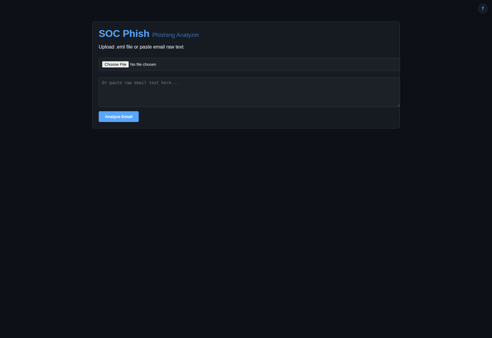

# soc-phish — phishing email analyzer & IOC extractor

> Paste a suspicious email, get a verdict — header analysis, IOC extraction and reputation lookups in one pass

  

Phishing triage is the most repetitive job in a SOC: open the mail, read the headers,
pull out the links, check them, decide. `soc-phish` does the mechanical part. Submit a raw
message and it parses the headers, extracts every URL, domain, IP and hash from the body and
attachments, checks them against reputation sources, and returns a verdict summary you can act on.

Part of a self-hosted SOC fleet: a small, dependency-light Python service with a web
dashboard, a JSON API and a built-in manual. No agents, no cloud, no telemetry.

## Features

- **Paste or submit** a raw email (`.eml`) for analysis
- **Header parsing** — sender alignment, received chain, authentication results
- **IOC extraction** — URLs, domains, IPs and hashes from body and attachments
- **Reputation lookups** via VirusTotal and URLhaus (when API keys are configured)
- **Verdict summary** designed for fast triage, not a wall of raw output

## Quick start

    cp .env.example .env
    env $(cat .env | grep -v '^#' | xargs) python3 app.py
    # → http://localhost:8091

Python 3.8+. Standard library only — nothing to `pip install`.

## Configuration

| Variable | Purpose |
|----------|---------|
| `VIRUSTOTAL_API_KEY` | VirusTotal key — URL/hash reputation (optional) |
| `URLHAUS_API_KEY` | URLhaus key — malicious URL feed (optional) |
| `PORT` | Listen port (default `8091`) |

## HTTP endpoints

| Path | Purpose |
|------|---------|
| `/` | Dashboard (HTML) |
| `/api/stats` | Analysis stats (JSON) |
| `/manual` | Built-in user manual |

## How it fits

Extracted IOCs can be pushed to **soc-intel**; confirmed phishing can be raised as a case in **soc-ir-cases**.

## Documentation

**[MANUAL.md](MANUAL.md)** — full user guide (also served at `/manual`, via the **?** button in the UI).

## Keywords

phishing analyzer · email security · eml parser · IOC extraction · SPF DKIM DMARC · malicious URL · VirusTotal · URLhaus · email triage · incident response · self-hosted

## License

MIT — see [LICENSE](LICENSE).
